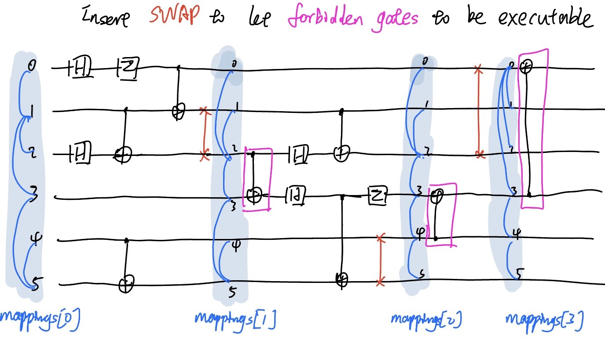

# Unitary Synthesis (UniSys SDK)

> Latest update date: 2023 August

## Dependencies
- numpy, scipy: for linear algebra calculation
- matplotlib, qiskit, cirq: for circuit object visualization

## Main functionalities

**Qubit mapping and routing:**

*E.g.*:

- Exact algorithms
  - ...
- Heuristic algorithms 
  - SABRE

**Gate decomposition examples:**

*E.g.*:

- Fixed gate decomposition
  - SWAP 
  - CH
  - CCX
  - ...
- Universal gate decomposition
  - Tensor product decomposition
  - ABC decomposition (2-qubit controlled-U gate)
  - KAK decomposition (arbitrary 2-qubit gate)
  - Quantum Shannon decomposition (arbitrary unitary gate)
  - m-control n-target CU gate decomposition
- Continuous-variable unitary synthesis
  - Reck decomposition

**State preparation examples:**
- Arbitrary two-qubit state preparation
- Arbitrary three-qubit state preparation
  

## Usage

See the [tests/](./tests) for more details.
